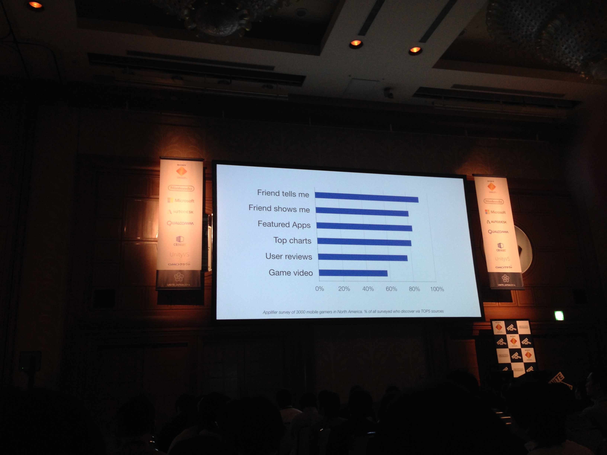

# 基調講演
## 冒頭
* オキュラスの人がきてる
* unityはコラボレーションが重要。OSSみたいな感じかな、一緒になって作業する
* 分業 コラボレーションのツール = unity

* 実際の規模
	* UFPS
	* 5000DL × $20
	* Asset Store : 2 week位の工数減る
	* 2000億円のsaving
	* Largest ever Marketplace

* 認知を広げるために
	* Prime - time TV
		* 100M pepole -> 高い
	* App market
		* 2B people now
		* 5B people soon
		* 50x growth in 20 years
	* 爆発的に伸びる、競争激化

* 課題
	* オーディエンスとのつながり
	* EveryPlay -> Unityの中に取り込む
		* どうやってゲームを見つけるか -> その場で画面見せるんじゃないか
			* 
		* 調査した -> 友人に見せてもらったが多い
		* game video
		* 口コミから広がる
		* ビデオで録画 -> share FBとかで
		* EveryPlayは2分でunityと統合できる

## unity5の新機能
* グラフィックス機能の強化
* 物理ベースシェーディング
* universal sharder
* 今まではshaderの組み合わせが必要
	* 一個のshaderのみOK
* reflection probe でリアルタイムの反射
* リアルタイムグローバルイルミネーション
* 二次反射、三次反射を表現
* 光源を動かしたりもできる
* OpenRLで組み合わせることで、グローバルイルミネーションを数秒で反映される
* リアルタイムレイトレーシング、これの変更が3秒くらいで出来る。いままでは10分、1時間、一晩すらあったのに。これはアーティスト=サンにとってとてもすごい
* PBRについて。Universal Shader。リフレクションプローブによる反射表現。リアルタイムG.I.、Enlighten、OpenRL （エディター機能）。
* 質感とパラメータが直感的に操作できる
* イメージベースドライティング　image-based lighting
* 背景との一致
* グラフィックス以外
	* WebGLとの連携

## ここで戻る
* 新しい機能
* multi scene ediiting
* 複数のシーンを作業かのう
* マルチシーン編集。複数のシーンを同時に編集できる。
* SceneManger
* levelの管理が簡単になる
* やっとシーン遷移マネージャAPIが出来るのか

* Multi player networing
* infra ホスティングもする
	* Transport Layer
	* Low Level API client/sever model
	* HighLevelAPI
	* Mach Macer
	* ReLay Server 

## まとめへ
* 何が次にくるのか、
	* virtual realityが次にくるのでは
* オキュラス
* SAO大好きやったなあ
* リアル以上の体験
* お金がなくてもテクノロジーが手に入る
* VRにようやく大手が注目する時代がきた。偶然では無い。なぜならテクノロジーの準備ができたから。小型モーションセンサー、高解像度、レンダリングパワー。レンダリング技術
* 技術の躍進はあるが
	* グラフィックスは多少は良くなってますよwwww
* ゲームはハードウェアの限界を追求してきた。2Dができるなら2D、3Dができるなら3D追加。高解像度などやってきたが、進歩のテンポが落ちてきてしまった。ここでVRが突破口になると考える。
* 軍事用のVRとかSAOやん。。。
* VRに必要なもの inputデバイス
* Latencyが問題
	* FRが下がる
	* VRはいろいろな処理があってレイテンシーがやばい。レイテンシーが低いと酔ってしまう。DK2は90hz（っていってたかな？
	* 60fpsは最低ライン、商社向けVRは90Hz!
* ゲームの移植大変 -> ほぼほぼ不可能
* VRはゴールドラッシュみたいにすぐに入っていけない
	* VRは最初からかんがえて作らないといれられない
* 日本でのコンテンツが一番、最初からVRを前提として作ったものが多い。海外だとまず移植から考える人が多い
	* Oculas japanの設置
	* DK2
