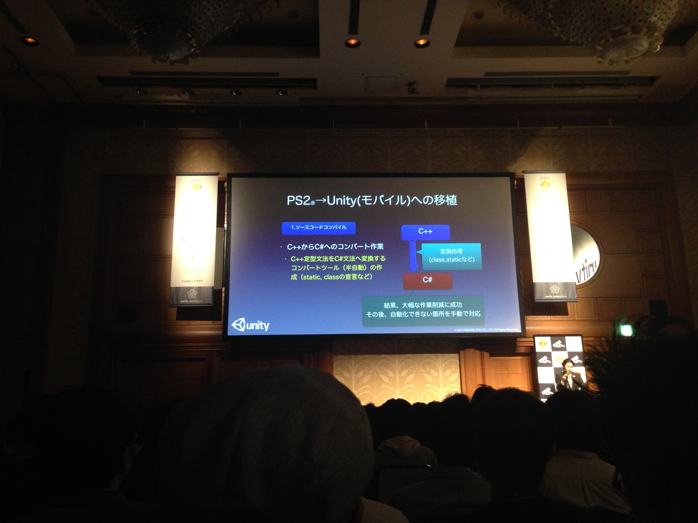
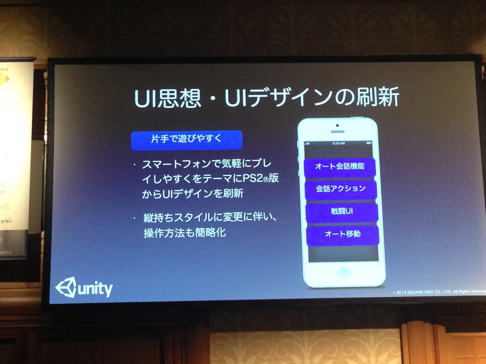
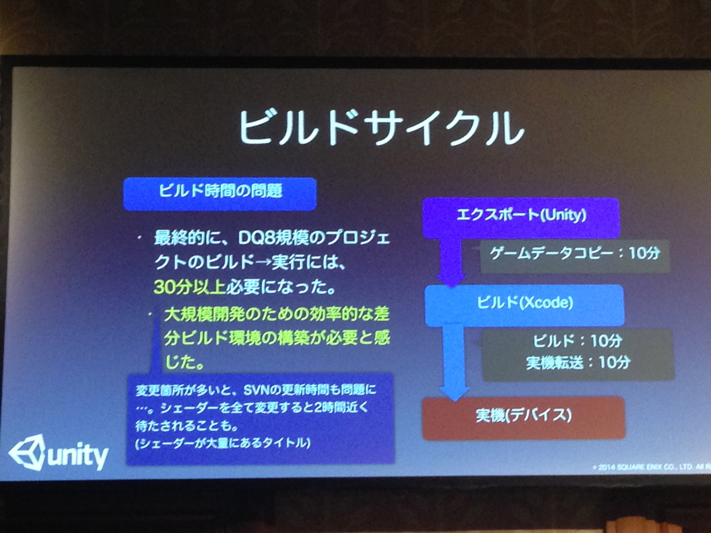
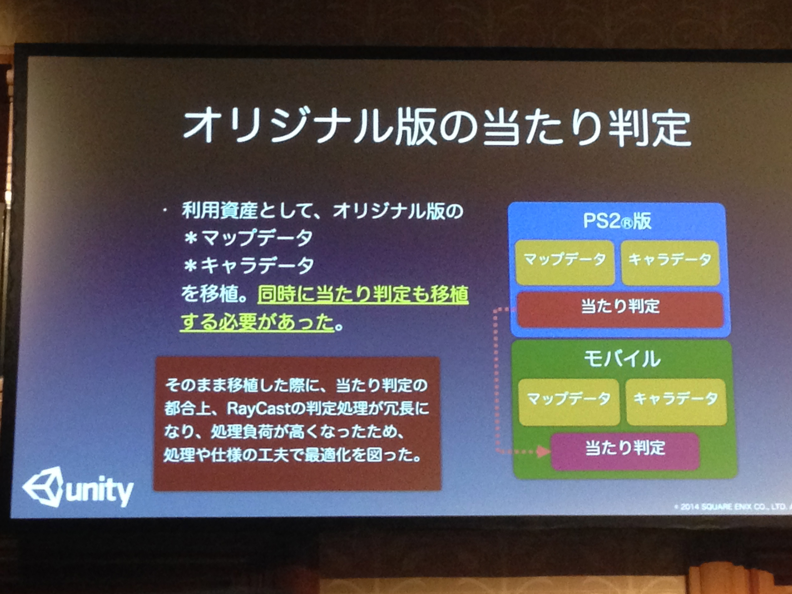
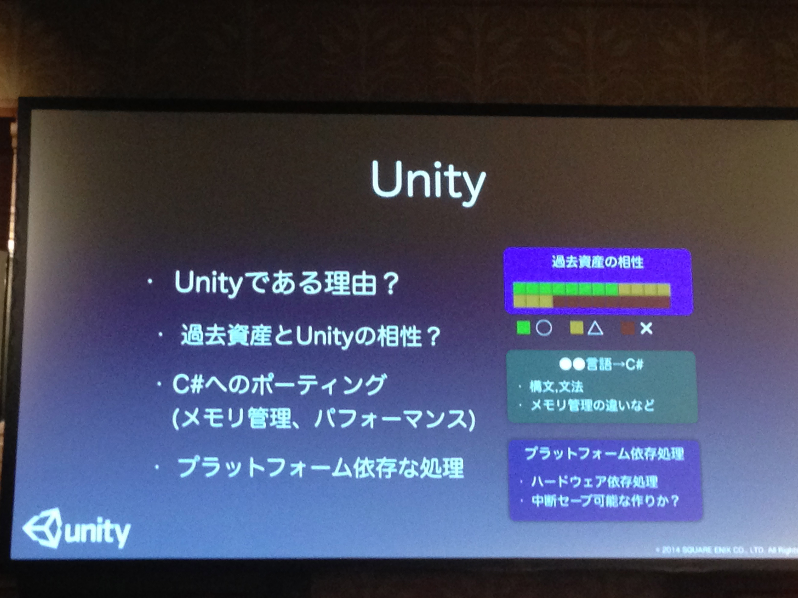
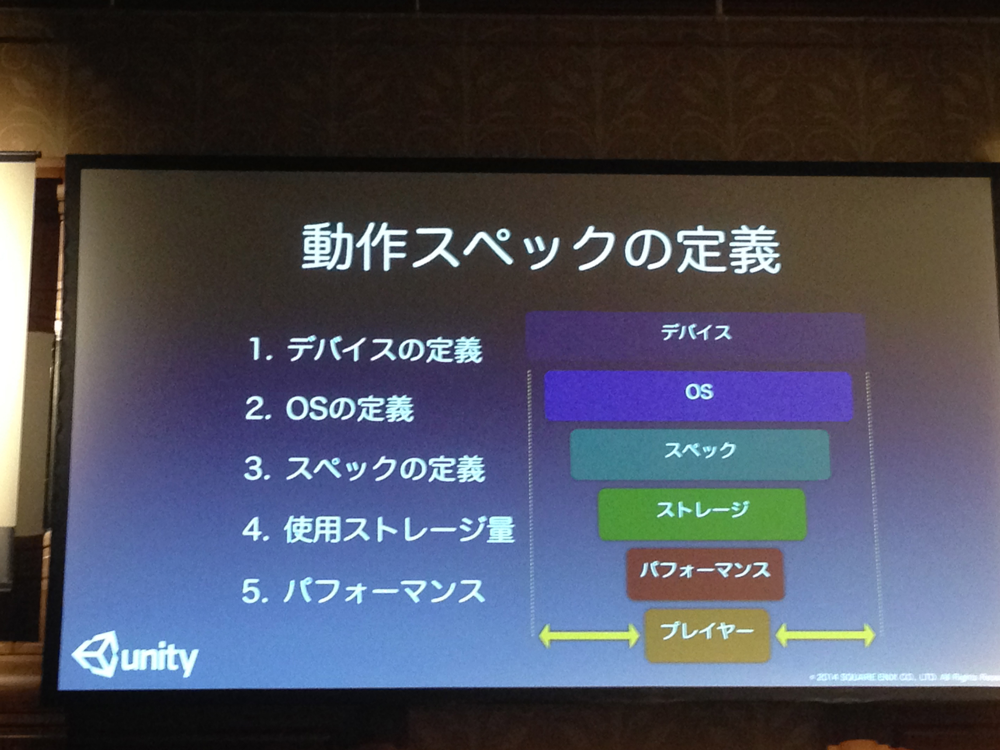
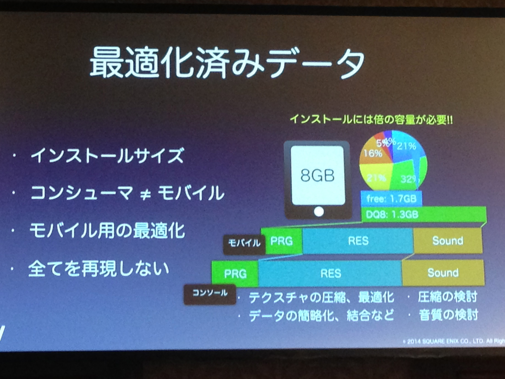
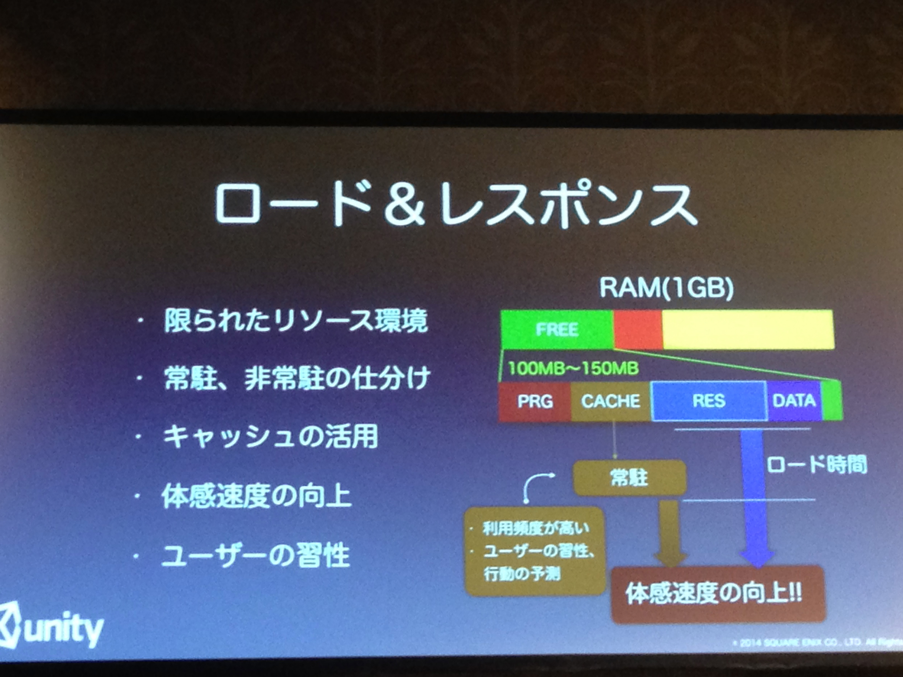

# Unity で コンソールタイトルを移植する ～ドラゴンクエストVIII 移植から学ぶ、大規模開発テクニック～

## プログラマー編
* c++ からc#へのコンバート
* コンバートツールの作成
	* ざっくりと変換 -> 少しは手作業
	* コメントアウト -> ビルド通す -> コメントアウト外す
	* GCがおおいので、作りなおしもある
	* 
* マルチUV
* シェーダー
	* 4600子のシェーダー
	* batchで作っている
	* カクつく -> 先読みで対処
	* 複数の機能のブレンドを1つのシェーダーにまとめたりして数を減らした。 
	* 数がありすぎて、マテリアルインスペクターから選択が不可能。さらに問題はシェーダーコンパイルがランタイム随時なのでカクツキがめだつ。よく利用するシェーダーをまとめて先読みして処理した。

## ゲームデザイン編
* 
* 片手で遊びやすく
* ボタンがないイライラ感の解消
	* -> 画面を見ただけで判断できるように変更
* オート会話機能
	* 近づいて止まるだけで会話開始
	* 近づく -> 話を聞きたいと追うこと
* 親指が届く範囲(下半分に)にボタンは設置

## ビルドサイクル
* 
* 日々の作業がじかんかかる
* SSDのっければ早くなる お金で解決

## あたり判定
* RayCastの拡張してる。
* 
* RayCastを飛ばして、あたったら更にRayCastを飛ばすという拡張
* 数百回のRayを飛ばすこともある
* マップではUnityの当たり判定で受けてからPS2の処理に渡してやることで、コリジョン抜けをしないようにしたとか。ヒットした座標からレイを飛ばしてやるため冗長に
* ということで重くなったので、プレイヤーにだけ適用して、村人などはUnity判定のみとした
* Unityの当たり判定は「一番近いポリゴン」なんですが、オリジナル版では属性があり、近いけど無視する　みたいなのを実現する必要がありました

## 移植のポイント
* １つ目ですが、Unityで移植するべきかの判断です。過去資産とUnityとの相性を調べましょう。もっとも大きな壁として言語の壁があります。あとGCとかの問題
* Unityで移植を成功させるには。まずUnityで移植するべきかどうか。過去資産との相性。言語の壁。どうやって移すか。メモリ管理が異なることによるパフォーマンス。メモリ不足など考慮。
* 中断セーブ可能な作りかどうか -> 移植できるかのおおきなポイント
* 

* 動作スペックの定義
	* ３番目は最適化済みデータです。最終的には1.7GBになりましたが、インストールには倍ぐらいの空き容量が必要
* 

* 全てを再現しない
* 

* キャッシュはかなり限られてる(最大でも200MB) -> キャッシュの活用場所を考える
* ロード＆レスポンス。使用できるメモリが少ないので、メモリに載せるデータをよく考えること。また、ロードレスポンスのためにはキャッシュをうまく使う。シェーダーの例もその１つ。
* 
