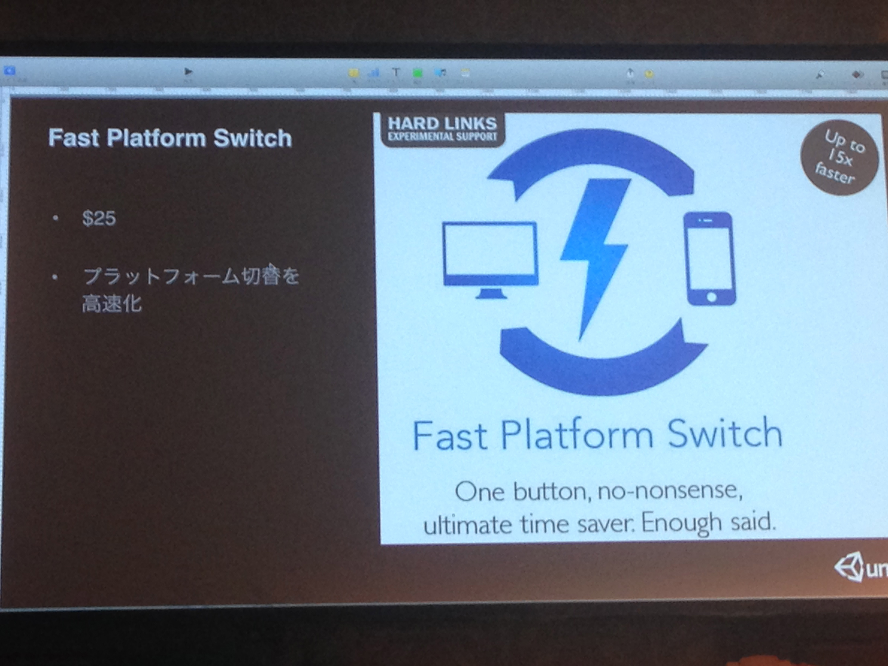

# Asset Store マニアクス 2014
## SkyShop unity5で付く 4でも使える
* 
## RobotWarrior2
* 戦車の3Dモデル
* 色々アクションがが揃っていてよい
## Nugget
* 言わずと知れたlegend

## Shader Forge
* strumply shafer editor 

## Tread Ninja
* スレッドらいくなコルーチン
* 別スレッド
* Spicy Pixelが似たAssets
* ランタイムのシーンマネージャー。LoadLevelAdditiveでは読んだものをアンロードしたい場合に、どれがそうだったか区別できるようにしておく仕組みがひつようだった。そうしないで良いような感じかな。。。
* 
* 
* 

## Aoi chan
* 

## Ferr2D Ferr2DTerrain
* 
	* 2D Terrain Editorもあるが、Ferr2Dのほうが便利
	* GUIから2Dのマップを作れる
	* コライダーとかも結構自由に作れる
## Easy Masking Transition
* 
* 
* 簡単にtransitionを作れる
* これは便利だな

## FastPlatform Switch
* 
* 要はキャッシュしているだけだが、かなり高速化が図れる

## UniMerge
* 
* sceneのマージをしてくれる。
* 差分の表示もしてくれるので、確認しながらmergeができる

## Asset Store tools
