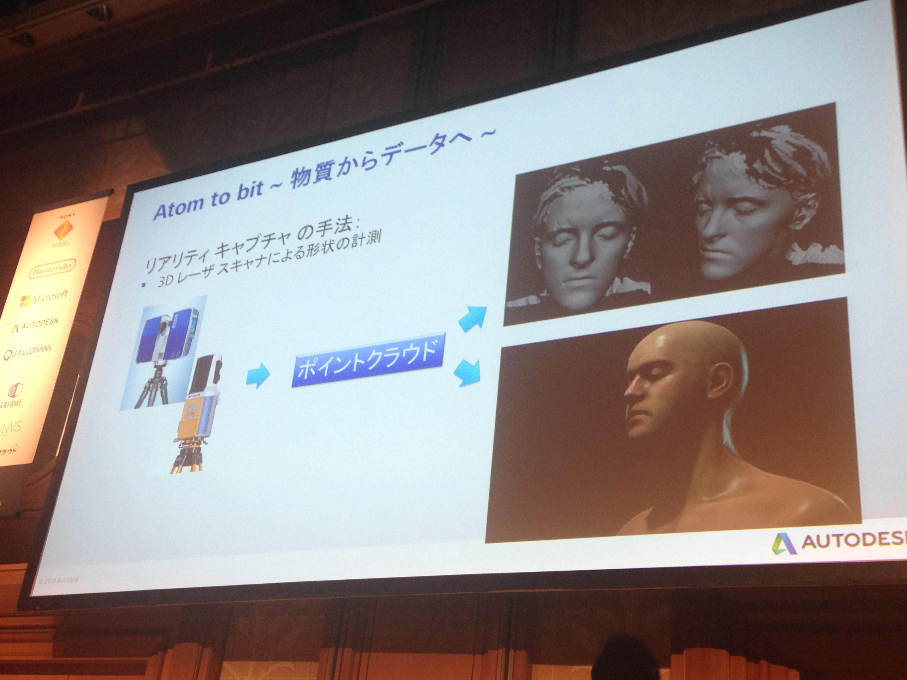
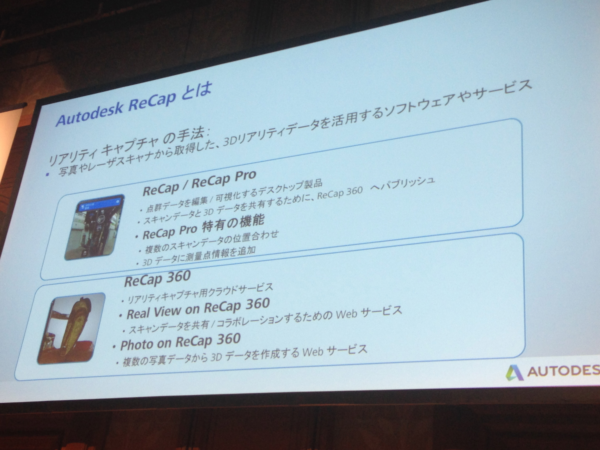
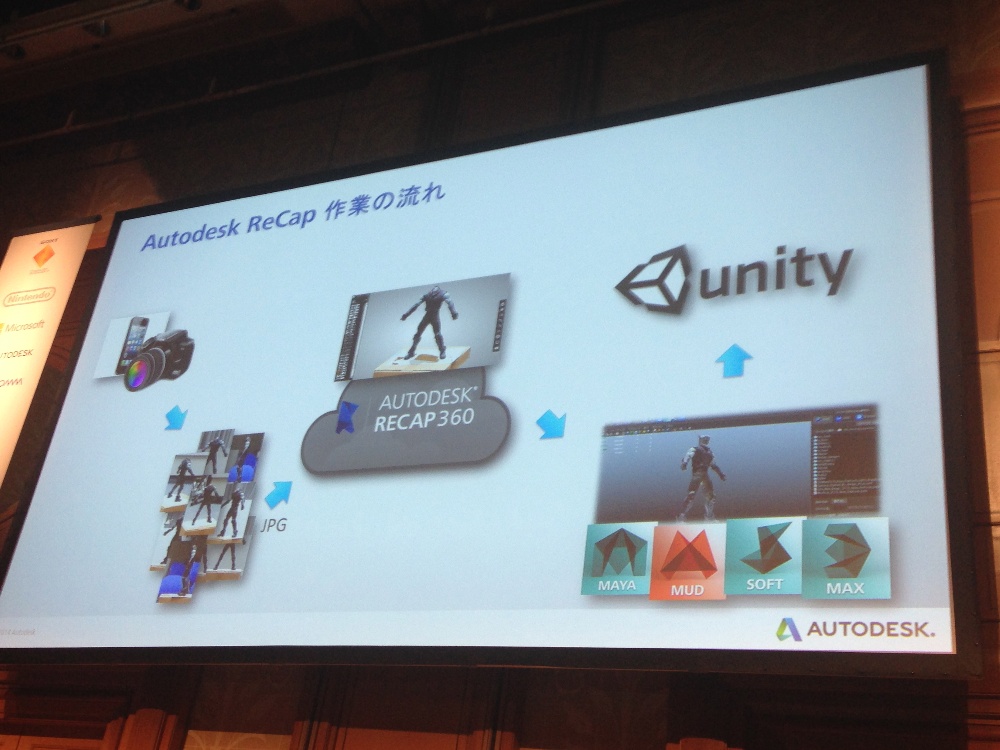
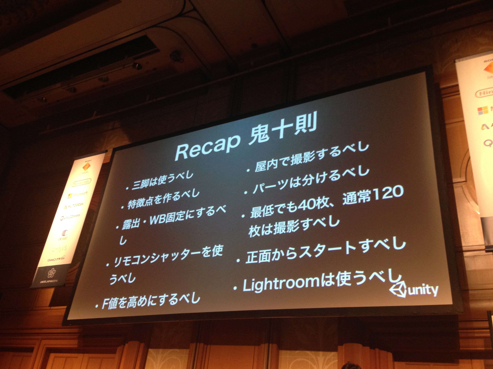
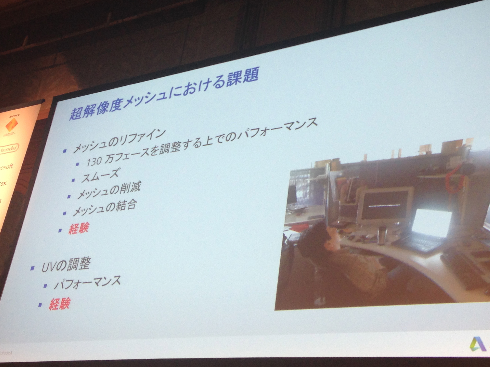
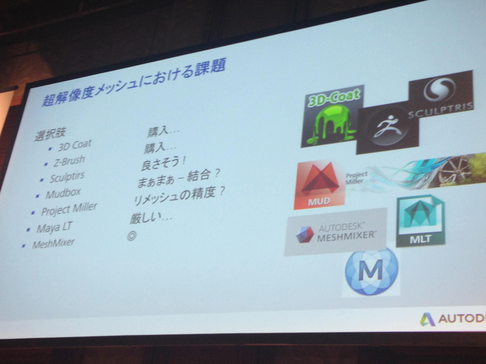
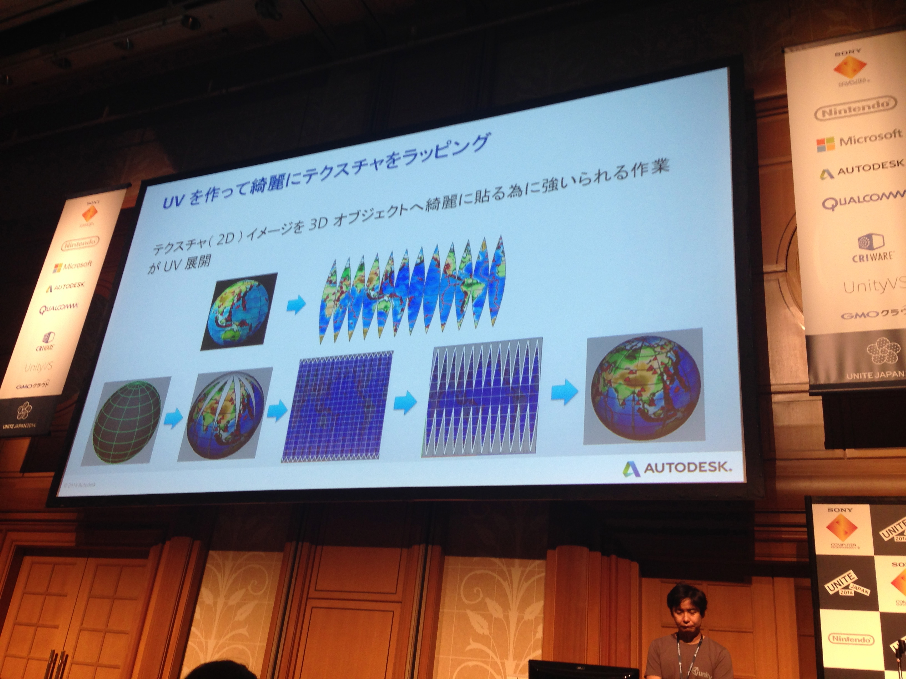
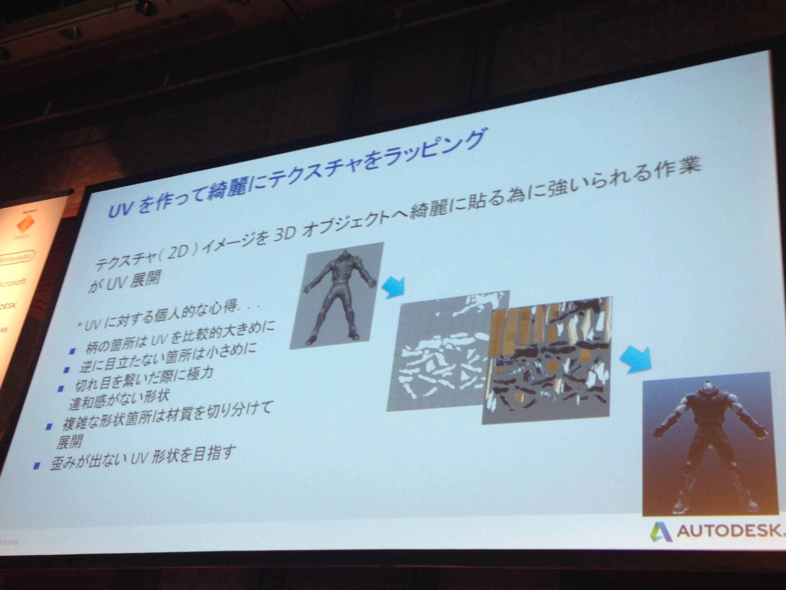
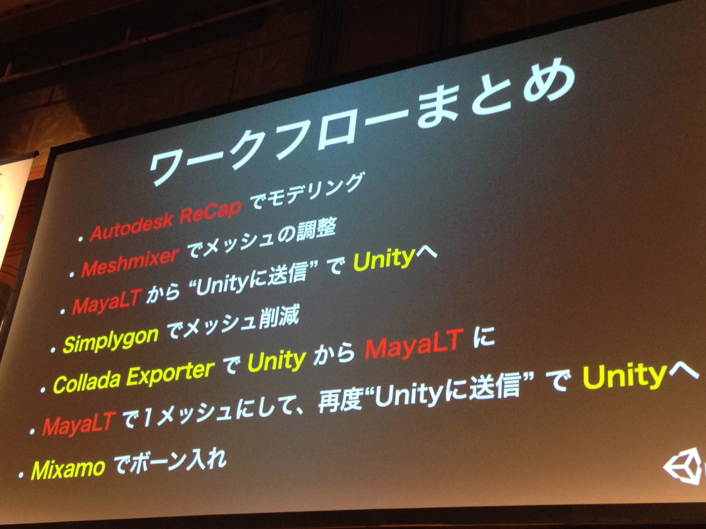

# 誰でも出来る! MayaLT を使った Unity アセット制作ワークフロー
* Atom to bit
* 
* リアリティキャプテャ
* 現実世界でのBRDF SOC200

* フィギュアを元にデータ化してゲームに使っていこうというセッション。DFから借りたエクスマキナのキャラフィギュアから。
* 3Dレーざースキャナに
* Autodesk ReCap -> これはwebサービス creditかかる  １回700円位
	* 

* コツがあるのか。。。
* Maya LTを通さないとunityでは使えない
* 

* 今回は141枚のPhotoを
* AutoDeckRecapのコツ
	* 
* 三脚を使うべし(シャッタースピードを落とす必要がある)
* 特徴点を作る あとでphotoshopで消す。。。。
	* ReCap で綺麗に取るコツのひとつはシールを貼ったりマーカで印をつけたりして特徴点を増やすこと。余計なマーカは後で Photoshop で編集すればおｋ、ただテクスチャがまたがると修正は大変
* マニュアル操作にして数値固定
* リモコンシャッター使う
* 屋内で撮影する
	* 123dキャッチ
* 証明からスタート
* LightRoom使う

* 超解像度のメッシュの課題
	* 
	* メッシュのリファイン
	* パフォーマンス
	* Meshの結合
	* UVの調整
	* 超解像度メッシュができあがるまでの課題。130万フェイスを超える。
* 
* MechMixer Freeで使える
* UV
	* 
	* 
* MayaLTでsend to Unity
* ハイメッシュすぎる -> ローメッシュにして かつ ボーンも入れる
* Simplygon(unity asset store)
* Collada Exporter(unity asset store) unityの世界からMayaLTの世界へ移れる
* Mixianoでボーンを入れる
* SendToUnityをつかってハイメッシュをUnityの頂点制限に合わせて分割して送ってから、ローポリに変換して、Colladaにして出して、MayaLTで合成してUnityへ出してって行ったり来たりすごいなw
* ReCap -> meshmixer でリファイン -> Maya LT で UV 調整 -> Unity で Simplygon でポリゴン削減 -> Collada Exporter -> Maya LT で 1メッシュ -> Unity -> Mixamo
* 
