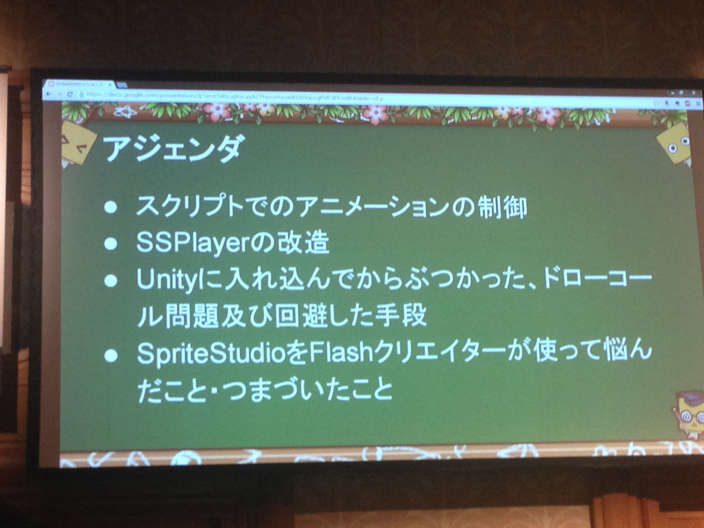

# Unity × KLab × OPTPiX SpriteStudio デザインとコードの 2面 Tips!
* ユーザーの要望にそって開発している
* 
* 
* SpriteStudio
* SmootheMoves
* スクリプトでアニメーションの制御
* SSPlyaerの改造
* フィーバー中のTime.scale = 0fだとSSPlyaerもとまってしまう
* Time.TimeScaleは便利だけど、止まってほしくないものも止まっちゃうから難しい

## クリエイターの人の話
* ドローコール多い
* アニメーションを配置しすぎると、ドローコル増える
* 同Z軸にアニメーションを配置しない
* エリアを分けて配置して表示する

* EasyGUI

* ミリオンアーサーSpriteStudio使ってたのか
* Vita版ミリアサはSpriteStudioでつけたアニメーション
* PocoTown
* クライアント側でアバターの服装変えたらサーバ側でアトラス生成して返してくれるって凄いな～
* メルクストーリア
* SpriteStudio 5.3からムービークリップ的な元パーツとインスタンスパーツの機能が入る
