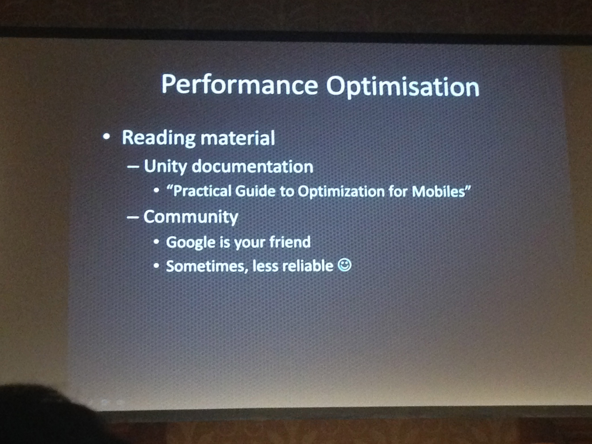

# 多様な Android デバイス向けに管理・最適化を行うには
* すげーな 32年か。。。。俺のとしと一緒やんけ
* アンドリューさん。32年前からコンソールプログラマー。ここ数年はAndroidのゲームをつくってます。iOSはプロビジョニングがひどくてあんまりやる気しない
* Unitron google playで見れる
* 物理コライダー physicsコライダー
* retinaがあれば、座標で表現できる
* シンプルに
	* 
* 特定の端末でまずいばあいは、特定の端末だけ公開しないようにできたりする。またマルチタッチが必要かどうかなどハード的な要件でオンオフできる。ただ、特定の端末をフィルターするのはオススメしない
	* 
* Android Manifestはイジる必要は殆ど無い
	* 上書きできるので、方法は写真
	* 
	* マニフェストは通常Unityが自動でやるから何もしなくて良いが、一部のアセットを使いたい場合は自分で対応しないとならないこともある。

* 古いandroidのバージョン
	* 
* 基本android versionはunityにお任せしたほうがよい
* アーティストにPhotoshopでのモックアップを作ってもらわない方が良い。そうすると特定の解像度に依存してしまう。UnityEditorで作ってもらう方が良い
* pixel perfect
* uGUI 4.5 4.6

* スクリーン縦横比。3Dの場合は短い幅を合わせて調整すると良い。2Dの場合は長い方を合わせてやると良い場合もあるかも。
* スクリーンサイズ。RawPixelについては気にしないこと。PixelPerfectはコンソールではやるがモバイルでは考えない方が良い。もしやろうとするとものすごい数の解像度に対応しないといけない
	* 

* ゲーム画面の形状を帰ることで対応する。自動的にゲームの配置を行う場合は使えるでしょう。サッカーのピッチでも微妙に場所によってサイズが違うのでOK
* ということでピクセルで考えてはいけない。数式で対応するべき。
* mで計算とかする。計算しろってことだな
* さっきのばあいはゲームエリアが面積が等しいように調整してやれば問題ないということもあると。
* 
* 
* 
* 
* 

* パフォーマンス最適化
* パフォーマンス最適化。モバイル用の最適化についての他の情報を参照するのが良い。 
* プロファイラをみるポイント -> 基本的に
* プロファイル。Pro版の機能。プロファイらを起動して、WifiかUSBで接続して使う。ん、そりゃそうだ
* 

* 圧縮Textureを使うと、
* テクスチャフォーマット。圧縮テクスチャはサイズも大きいし描画も遅い。圧縮すると2倍速く描画できる。
* レンダリングパス。FowardRenderingよりもVertexLitの方が早いので見た目に問題なければそっちを使うと良いってことかな
* 
* 
* 

* オーディオの圧縮はあまりオススメしない
* メモリーに乗っけておく
* オーディオの圧縮はお勧めできない。圧縮するとCPUが使われる。（これはCRIつかったら良いのかもね
* 3Dオーディオが必要ない場合はOFFにすると40％はやくなった
* 
* 

* NativeRenderingPlugin。レンダリング時にコールバックをうけられる。パフォーマンスのために苦労を惜しまないひとのための措置とのこと。Unity4.5にて。
Unityを使えばAndroid NDKを使う時にJNIは不要。
* 
* 
* 

* 

