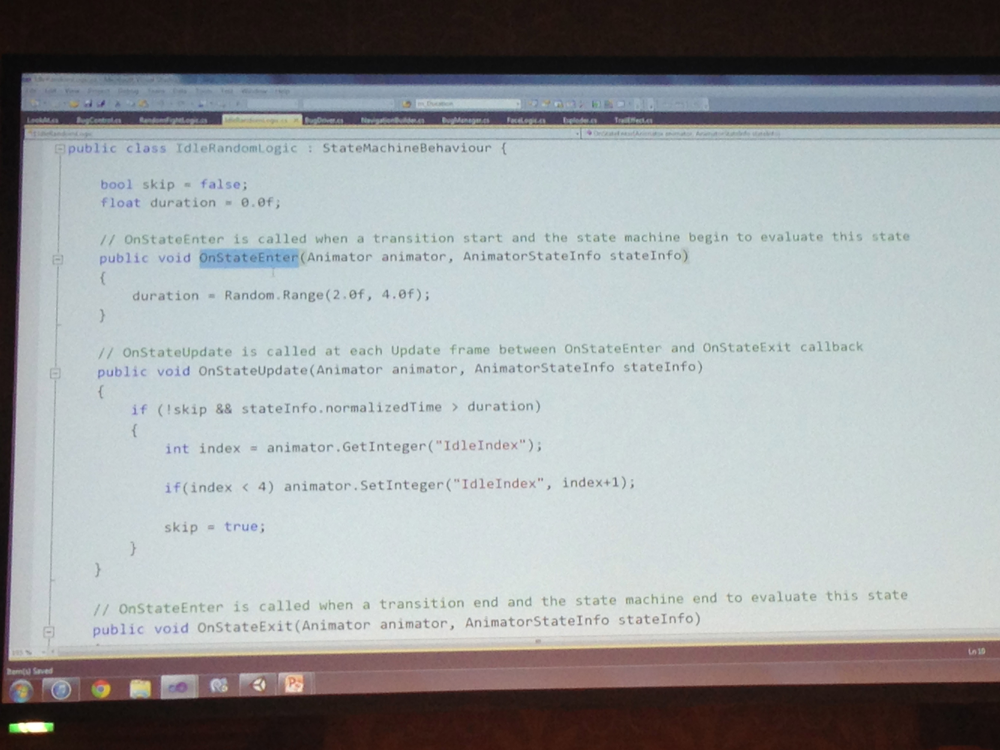
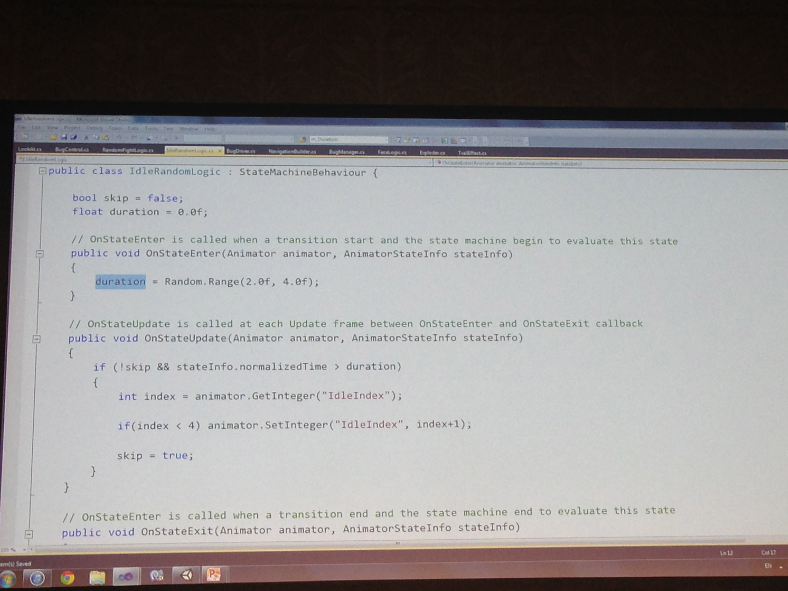
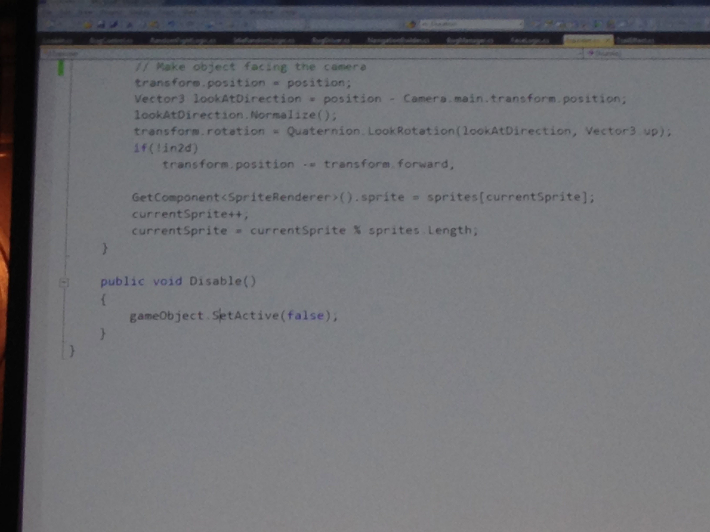
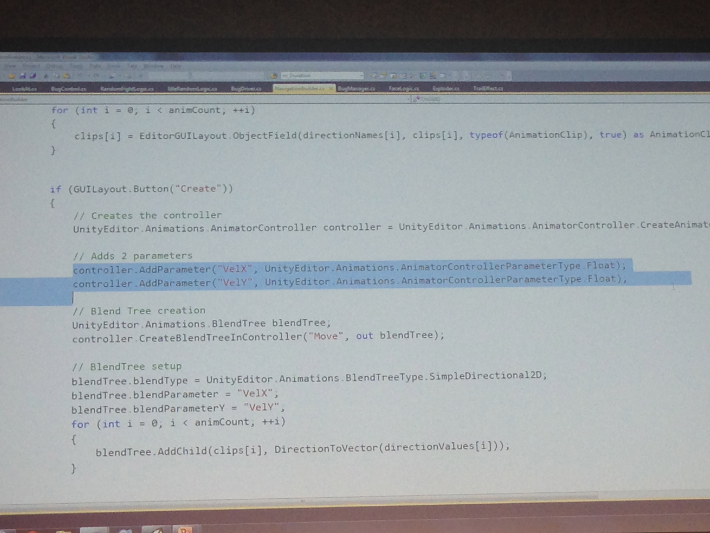
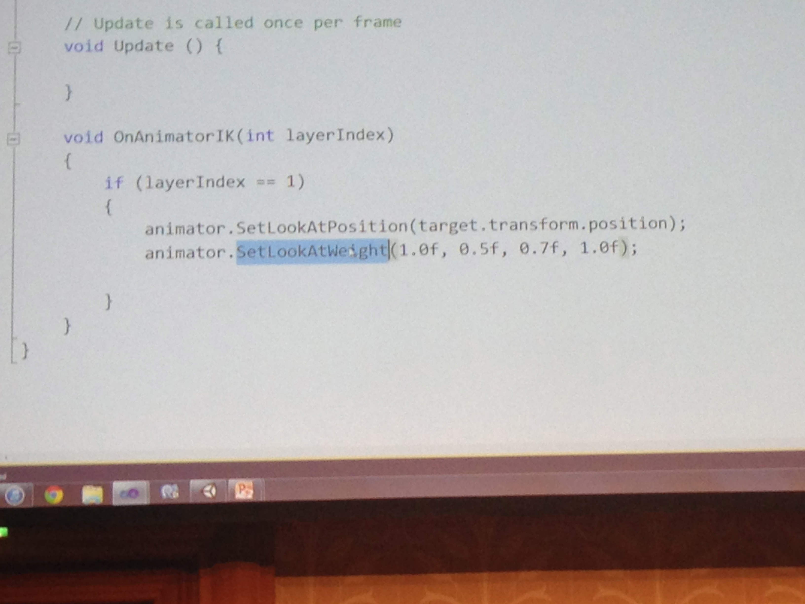

# Mecanim 徹底解説 2014
* unity5で使える機能の紹介
* Entryノード exitノード
* statemachineにロジックが付けれる
* StateMachineBehaviour には、OnStateEnter / OnStateUpdate / OnStateExit / OnStateMove / OnStateIK がいる。ここからステートマシンを制御して活き活きとしたアニメーションが出来る。
	* 
	* 

* behaviroeのコールバックで色々visualのフィードバックをついかできる
* ビヘイビアのコールバックを使うことで必要な際にエフェクトを追加したりできる。モーションにつけなくてもビヘイビアのコードで指定してあげれば良い

* アニメーションは相対位置で動くようにする
* generate root motion
* 全てスクリプトからコントロールできる

* 前に進ませたいアニメーションを作りたい場合に、通常は絶対値ではいるのでずっと進むモーションは作れないが、RooMotionを使うとずっと進むように作れる。
* メカニムをスクリプトで生成できるようになった。スプライトのアニメーションが流用可能ではなかった、のでスクリプトで生成するのに向いている（のかな？
* AssetCreationAPIを使うと、アニメーションを生成して、ステートマシンとトランジションの生成がすべてできるようになった。
* Unity5 Mecanimがかなり良さげ。StateMachine behaviorでアニメーションにcallbackを指定できるから、かなりカスタマイズが楽になる。
* MecanimのBlend treeも機能強化された模様で、たとえばmixしたプレビューの向きが自由に変えられるようになった
* 顔のアニメーション。DirectBlendTreeを使うと好きなブレンドをコントロールできる。これでステートでブレンドをコントロールしてスコアに応じて笑顔になるとかをやれる。
* ステートマシンの遷移（Entry / Exit ノードの追加）、ステートマシンの Behaviour による制御、Asset Creation API でオーサリング修正など、ブレンドツリー強化、ルートモーションを独自でオーサリング、ダイレクトブレンドツリーの追加 

* 
* 
* 

* Q；キャラの制御がAnimator以外のコントロールが必要になる。AIは別のステートマシンでやっていた。こういう場合に他とやりとりできない。Animatorにランライムのデバッガを追加して監視したり、他のステートを参照できるようになったりしないか？ #unitej
	* A；ビヘイビアツリーとメカニムのステートとの同期が難しいということですか？どちらかをマスターになるかを決めないといけない。あるステートに入ったらビヘイビアツリーを矯正することができる。逆も可能。
Play のかんすうをつかえばビヘイビア側からメカニムのステートをセットできる。 
	* Animator自体はカスタマイズできないっぽいな。API公開についてはEditor側の話でランタイムとは関係ないと

* 今回の話でプロ版のみなどの限定的なものはあるか？A；まだ決めていない。
