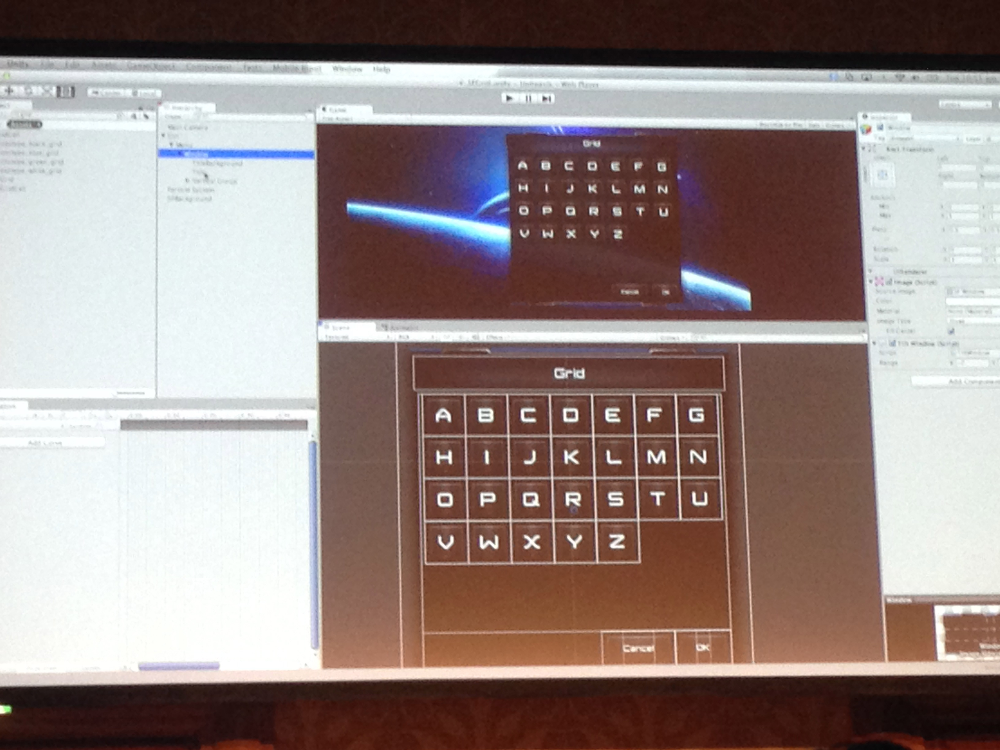

# 自分だけの Unity GUI を作ってみよう
* 新しGUIシステムの紹介
	* そもそも問題点が結構ある
	*  
* ボタンを回転とかも難しい 体裁も良くない
* スクリプトを書かなくてもそれなりによく見えるように

### Canvas
* world space 
* screen space -> 今までのNGUIぽいな
* screenサイズ、全ての上に乗っかって
* Canvas。ワールドスペースとスクリーンスペースの2つの座標系がある。スクリーンスペースの場合は画面の上におかぶさって描画される
* 
* Canvasはwidgetのようなものか CanvasってNGUIのPanelみたいなもんか
* 今のはworld space
* Textureの上に文字がレンダリングできる
* ワールドスペースのCanvasはそれ自体がオブジェクトとして移動や回転したりできるもの。
* screen space canvas
* ゲームの上に重なって表示される
* ゲームビューに比例して大きさが変わる
* スクリーンスペースCanvasはゲーム画面のサイズによってサイズが変わるもの。
* むむむ、今ヒエラルキー上のオブジェクトをD&Dで並び替えてGUIの前後関係を入れ替えたけど、ヒエラルキー上の並び順はオブジェクト名依存じゃなくなったのか？
* ルートオブジェクトにキャンバスコンポーネントを適用したものがいて、ワールドスペース/スクリーンスペースどちらにもおける。3D 的な視点が欲しい場合はワールド。描画順はヒエラルキー
* High levelでできること
* simpleなアニメーションを適用できる

### RectTransform
* 
* 
* RectTransform。unity4.6からのコンポーネントで、Canvas上に配置するのに使うが、自動で伸ばしたりなどの指定ができる。
* RectMove -> world spaceであれば、リサイズできる scaleは影響はうけず、高さ、幅の数字が変わる
* RectTransformツールをつかうと、GUIのCanvasサイズを変更するような操作ができる。回転もできる。これによってサイズが変更されるとGUIの中に乗っているものは再レイアウトされてスケーリングされるわけではない。スケールしたい場合はスケールをつかって
* Elementのlayout
* rect transformの使い方
	* 相対位置 ancher positionをいじれるのか
	* アンカリングと相対的な位置を操作可能
	* RectTransformコンポーネント左上にアンカーとどこを伸ばすなどの指定を選択できる。これによってリサイズに応じた加工の指定ができる
* Rect Transformにはx, y, z, Width, Height, Anchors, Pivot, Rotation, Scaleが。レイアウトはInspector上でかなり柔軟に編集できるようになったっぽい。
* paddingなどもSceneビュー上で可視化されてかなり使いやすそう。
* 絶対値、相対値を自由にできている、これもNGUIをベースにしているなあ
* パディング調整の際にどこの値が変わるのか画面に出てくれるのもいいな
* 固定サイズは使わない
* アライメントを適切に設定する
* アンカリング
* Anchor Presets で相対位置（中央配置等）で配置できたり、Stretch 設定して親のサイズに追従させたり、Padding 設定してレイアウトできる。 しかも GUI でイイ感じに表示してくれて分かりやすい
* uGUI、アンカーは必ず親を見るみたいだなぁ。座標制御と、描画順がどちらも親子関係に依存してるから、NGUIと比べていくつかの機能が隠されているような印象を受けてしまう
* グリッドで適切なサイズで埋めることも出来る。CSS で float 設定したみたいな感じ。
* 自動レイアウトについて。指定した範囲にアイテムを並べるようなことを自動でやってくれる。リサイズに応じてちゃんと並び直してくれる。
* AutoLayout グリッドが自動的に埋まる
* 

### Drawing controll
* 
* imageの紐付け
* アスペクト比変更せずに拡大できる
* sliced -> imageのはじのpixelを維持する
* sprite editor スライシング
* Image コンポーネントの Image Type を変更すると、Width/Height でそのまま変形させたり、アス比保ったり、Sliced でスプライトエディタから 9-slice っぽく出来る
* 4.6ではSpriteEditorを拡張し、スプライトのスライス（9スライスね）の指定ができるようになった。
* 
*  custom materialの追加
* rect transform テキストをひもづける
* rich text rendering -> markupできる 赤くしたりとか
* buttonなどに付けられるText。Font自由に選べる上にRich Textも対応
* Text コンポーネントは Alignment で簡単に配置できる。フォントの変更やマークアップ可能なリッチテキストも出来る、エフェクトも掛けれるしマテリアルも設定できる
* 独自markup言語でAttributedTextっぽいのが簡単に使える。超すごい
* 新しいイベントを処理できる
* 
* Interaction Controller（Buttonなど）をコンポーネントとして付加すると、イベントハンドリングが出来る。例えば Button コンポーネントを付加するとホバーで色を変えたり SpriteSwap でステートに応じてスプライトを変えられる #unitej
* ボタンのコンポーネントについて。Tintモードはステートに応じて色をかえる。SpriteSwapモードではスプライトを変える指定。AnimationModeはアニメーションが指定できるという感じみたい。
* キーボードの上下でも選択できるの良いな。
* state管理にmecanimとの統合が図られてる
* 
* 

### animation
animation
mecanimとの統合
positionの変更をできる

mecanimが nested stateに対応
* 新しいメカニムはGUIに適用できたり、入れ子のステートも定義できる。
* アニメーションは大事。そこで Mecanim と密に統合した。キーフレームアニメーションを作成し、Button の Trigger で設定したステートを Mecanim 側に送ってリッチなアニメーションを GUI だけで簡単に設定できる
* Animationについて。GUIとメカニムを深く統合した。ボタンのAnimationモードの場合は、アニメーションと合わせてステートの設定ができる。これによってメカニムにステートの変更が送信されて処理が変わるようにできる

* 秘密のコードはない、
* 自分の好きな、GUIを作れる
* ドラッグ&ドロップコントローラを作るのも簡単。イベントシステムでインターフェースを継承すると OnDrag、OnPointerUp などでスクリプトをハンドル出来るようになる。例えば IDropHandler を継承すると OnDrop が使えるなど。
* 
* 
* 

### memo
* uGUI見てる。UnityもAndroidのレイアウトやiOSのAutoLayoutみたいな概念になりつつあるなぁ。 これが時代の潮流ぽい。座標指定の時代は終わりつつある。

