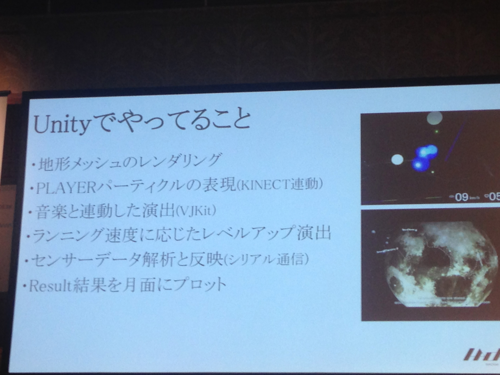
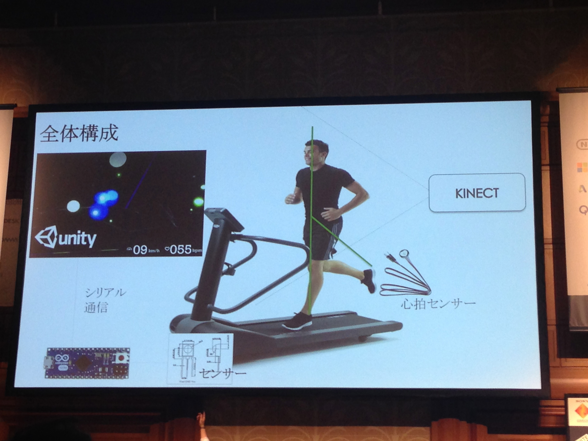

# フィジカルコンピューティング分野における Unity の可能性について
* フィジカル・コンピューティング
* istudioさん
* フィジカル・コンピューティングとは
* 物理的な世界と仮想的な世界との間に対話を作り出す分野
* トレッドミルに磁気センサー -> ardino -> unity
* 
* センサーデータ解析 -> シリアル通信

* 地形の表現が難しい
* OpenGLで実装 -> 重い 一番速度がでない OpenGLは使わないほうがよい
* まあ、結構普通
	* グラフカメラとメインカメラの２つ用意

* 回転ローラーに磁気センサーで回転速度を取得

* SXSWで発表した。。。。その話はいいかなあ。。。
* 広告だなあ
* 4/25 27 Digital Scramble
* 
