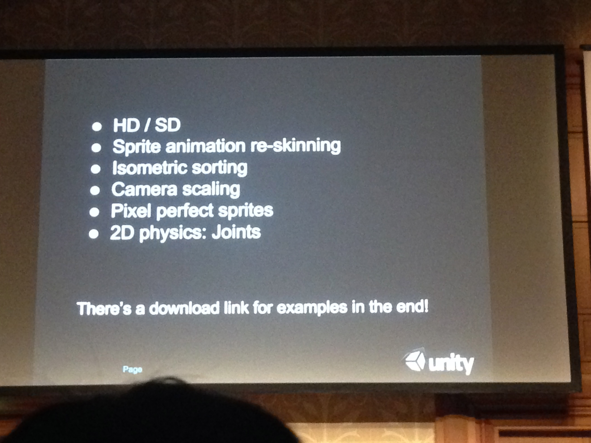
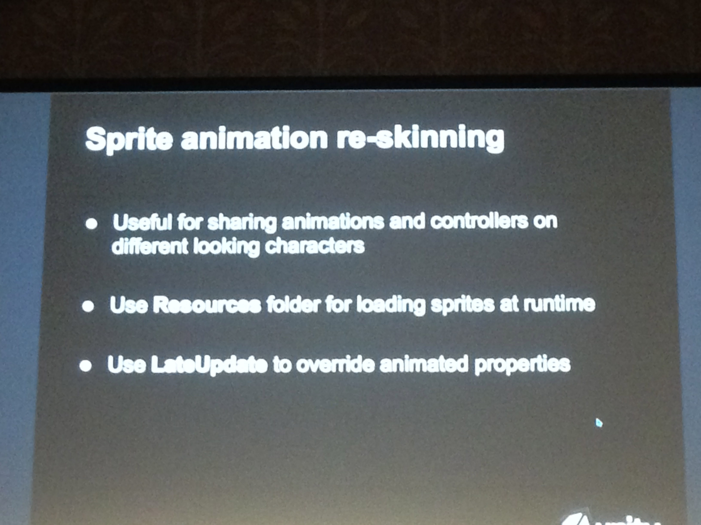
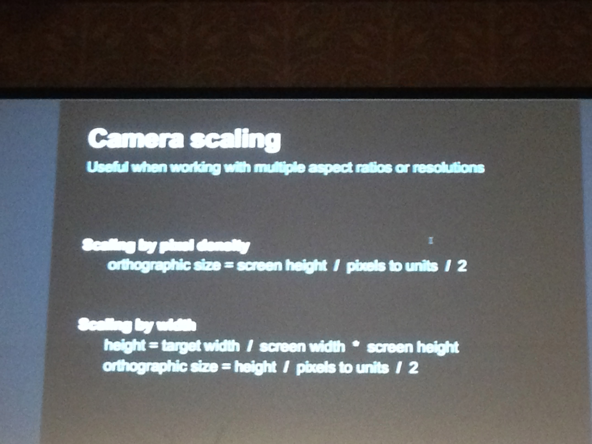

# Unity2D のよくある問題とその解決方法
* 問題解決
* DLリンクがあるにでメモとかいらないよー
* 
* HD SD
* 異なる解像度で異なるプラットフォームで使う場合に使う
* HD / SD は異なる解像度のスプライトを異なるプラットフォームで使うときの文言、低解像度のスプライトを Android、高解像度を Retina ディスプレイ等
* モバイルのビルドにデスクトップのビルフォニはいれたくないよね
* HDとSDの問題。イメージクオリティ、メモリの問題、ビルドサイズの問題などがある。で、二つの方法がある。リソースフォルダを使う、あるいはアセットバンドルを使う、しかし利点と難点がある
* 低解像度のスプライト 128 pixel
* SD と HDで名前が異なってファイルがある
* 物理的なファイルサイズが同じか確認する
* SDのスプライトのサイズをHDと合わせるのはインスペクターのpixelToUnitに倍率を入れとく
* 以前使っていたresourceを開放する
* resourceフォルダに入っている
* Resourceフォルダを使う
( Resource フォルダを利用した方法は、プロでもフリーでも使えるのが利点。具体的には hogehoge＠HD などと名前つけておいて、Editor スクリプトを書いてその切替をする。最後は Resources.UnloadUnusedAssets() を呼ぶ

* asset bundleつかって unity5のみ
* ２つのフォルダが有る、 HD と SD
* WWW使って取り込むのは変わらず
* HD SDを分けるには、asset bundleを使うのがよい
* bundleをする場合のスクリプトが4とはちがう
* Dependencyiesを使う
* sprite animation
* コントローラーの再利用
* resourceフォルダを使っている
* 同じ名前でspriteを作る
* updateとlastupdateの間で行われることもあるから
* LateUpdateを使う
* re skin animationコンポーネントをつかうと、アトラス名を切り替えられるようになり他のキャラにできる。ここで何をやってるか、LateUpdateで指定のアトラスをロードして同名のスプライトに差し替えるコードを書いてる。
* 

* クオーター view
* transformの中心点が下にある
* 
* アイソメトリックの例。縦の高さに応じてソートを切り替えられるようにした。スプライトのピボットが下にしてあるので、地面に並べるのに向いてる

* 2で割るのはわからない >_<
* Unityの中の人が何故か2で割ると上手くと話してた2で割る理由は単純で orthographicSizeは半分のサイズで指定するという仕様だからです #unitej
* スプライトのデフォルトシェーダーにsnap to pixel設定があり、これを有効にすると頂点がピクセルピッタリの位置になる。
* スライド http://goo.gl/Mv3JdE
