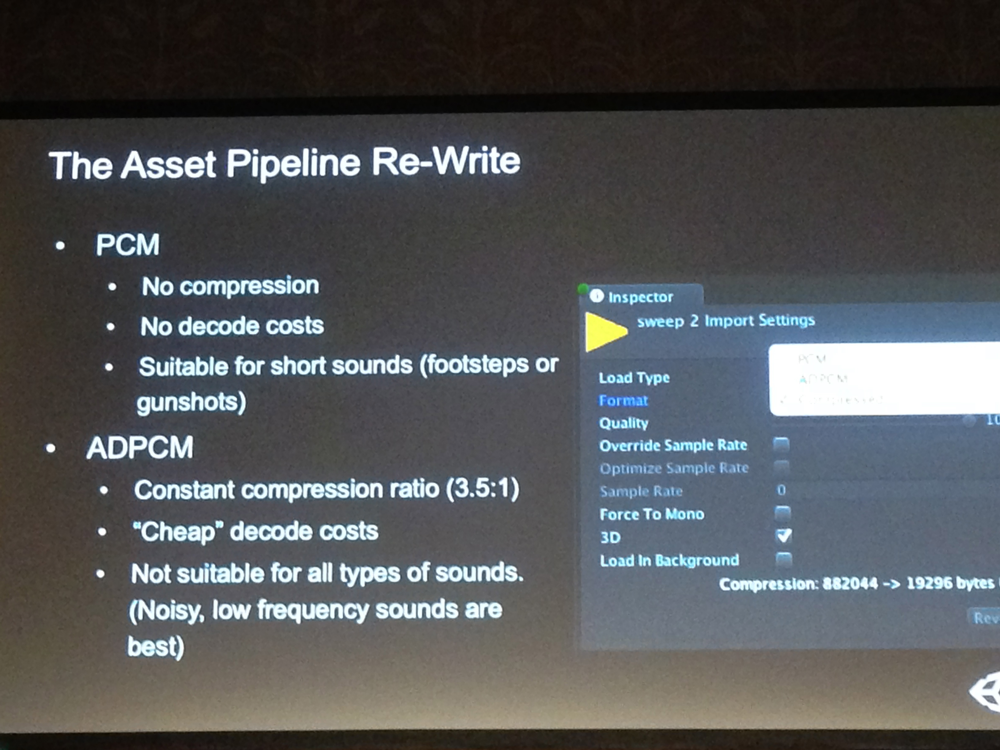
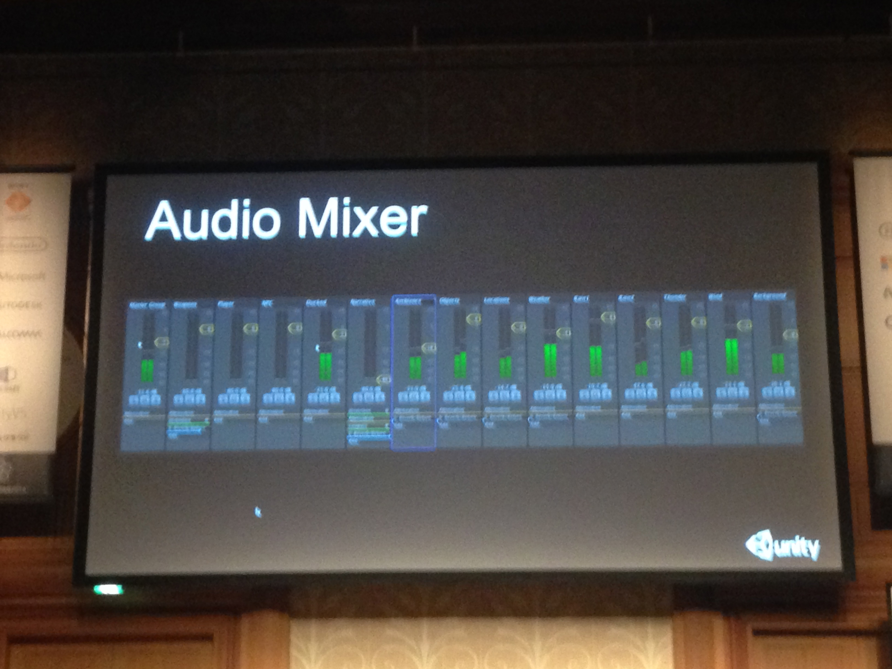

# オーディオ新機能ツアー 2014
* unity 5の機能
* audioに対する push 
* 
* 

* MP3はtargetからはずした　
* Vorbis tremor decoder
* メモリフットプリントが小さくなる
* sweepトーン ADPCM
* 

* メモリ使用量はは大分落ちた
	* しまった写真撮りそこねた >_<
* audio clipは小さくなった
* non blokingでもよみこみ可能になった(これも)
* 
* 
* 

* audioのロードをディレイ出来る、メモリに読み込んだりストリームもできる、オーディオクリップそのものの軽量化、ブロッキングノンブロッキングのオーディオローダ #unite
* 
* AudioClip周りのパフォーマンス改善。いまUnityでオーディオファイル読み込むの糞遅いからこっちは普通に期待大
* 

* editorの中でstreaming
* audoio mixer
	* 
	* 音のカテゴリ化
	* editorでできる
	* playmode中にマスタリング作業ができる
* mixing, routing, mastering/ effect / グルーピング/ プレイモード中にオーディオの編集をする感じになる。
* DAWツール
* audio mixerで出来ること：mixing, routing, mastering/ いろんなeffect / グルーピング/ そしてプレイモード中にオーディオの編集をする感じになる。 #unitej

* アンビアンス
* play中にmixレベルを調整できるのか そして保存されてる
* Effectも調整出来る

DSP Effect
Atenuation
DSP
VU metering

* C++ CのNative pluginがかける
* パラメーターも設定できる
* 
* 

* Effect
* custom UI
* 音に対してeffectを追加する
* 

* snapshot
* 

* Unity 5のAudioMixer、相当機能豊富になってきて普通にサウンドエンジニアが入れるレベルになりそう、逆に普通のプロトタイプにはToo Much感じある。でも使い勝手は良さそうだな。#unitej

* audio mixer : パラメタのスナップショットを取って、それをゲームプレイ中に遷移させていくことが可能。ゲームの進行に合わせて雰囲気を音環境から変える。

* transitionに合わせて音の切り替えができる
* かなり簡単ににtransitionの設定ができる

* mixerのコンポーネントをゲットして、エフェクトやらボリュームやらの変数をsetできる。ナイス。

* Ducking -> 周りの音が自動的に下がる
* 発話者の発言が聞こえるように、周りの環境音等を下げる
* duckingの意味がやっと分かった。コンプレッサやミキシングのかけ方にパタンがあるのね

* asset bundle まだないのか。。。
* NAtive plugin コールバックとDLLができればOK
* voice limittingは今後の対応