# Unity Test Tools
* テスト自動化の目的
* 最小限のコストで
* 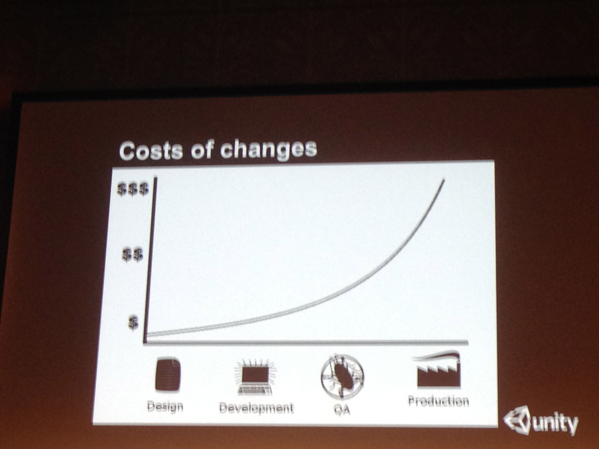
* マシンに移譲
* 副作用 -> テスト可能なコード ->  質が高いコード
* 細かく 分離　されていて 疎結合
* テストは品質の契約
* みなさんと、会社の契約
* 出荷しているコードが動くかを保証するにはテスト
* 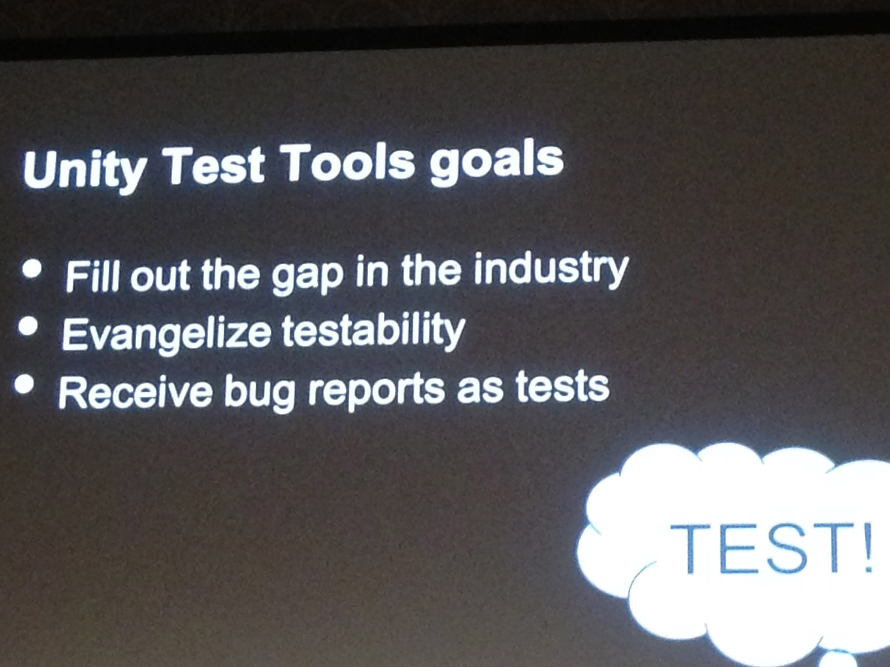

* コードの変更に関わるコストは急速に拡大する バグfix -> コードの変更

* ゲームというのは高度なシミュレーター
* 機能ではない要件が多い グラフィックとか
* ゲームは色々なアルゴリズム -> unit testはできる
	* これは実際のゲームでテストする必要はない
* 変更が起きる可能性が大きい
* 初期段階では予測不可能
* 回帰の防止

* unityについて
* bugレポートを発行するだけじゃなくて、再現コードを遅らせるようにする

* テスト自動化 自動化ピラミッド 拡張性がひくい
* テストについて
	* UI -> メンテナンすが難しい 書くのは簡単 -> これは対象外
	* Integration -> 
	* Unit -> 一番簡単 拡張性高い
* Unit > Integration > UI  automation pyramid  =>  Scalable >>> Unscalable
* 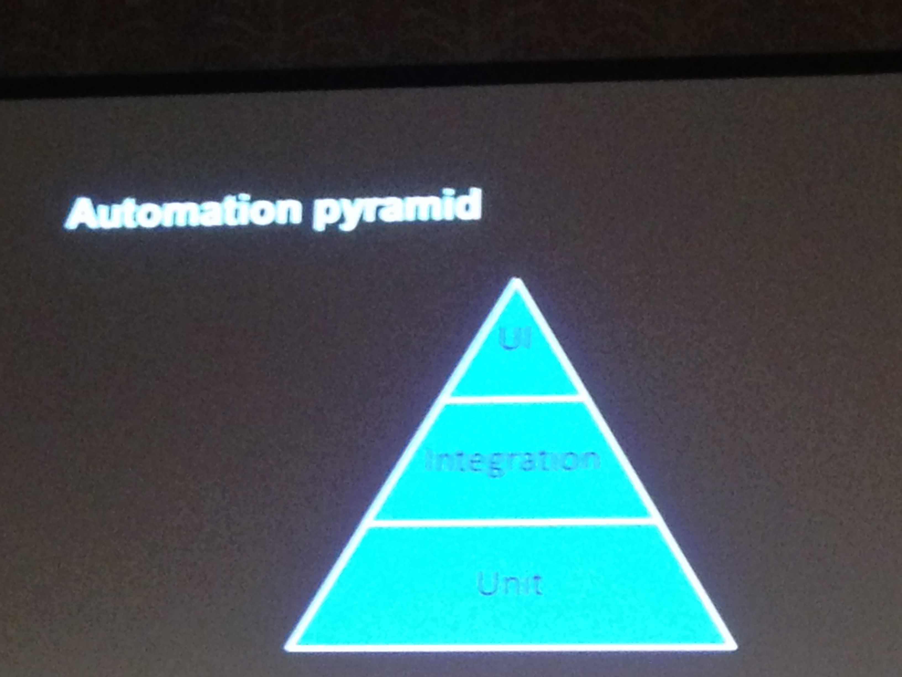
* 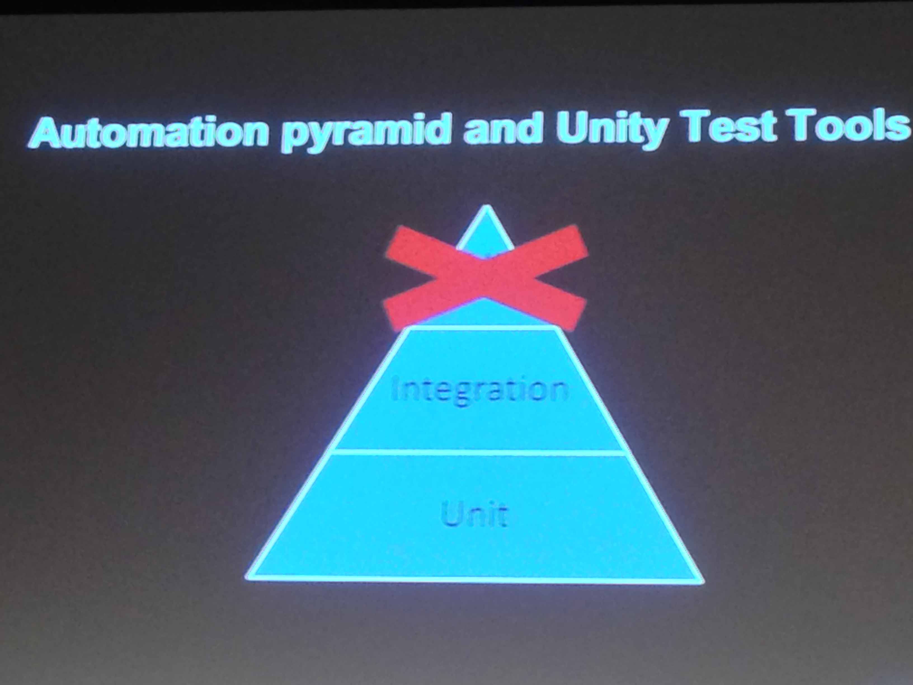

### unit test library
* 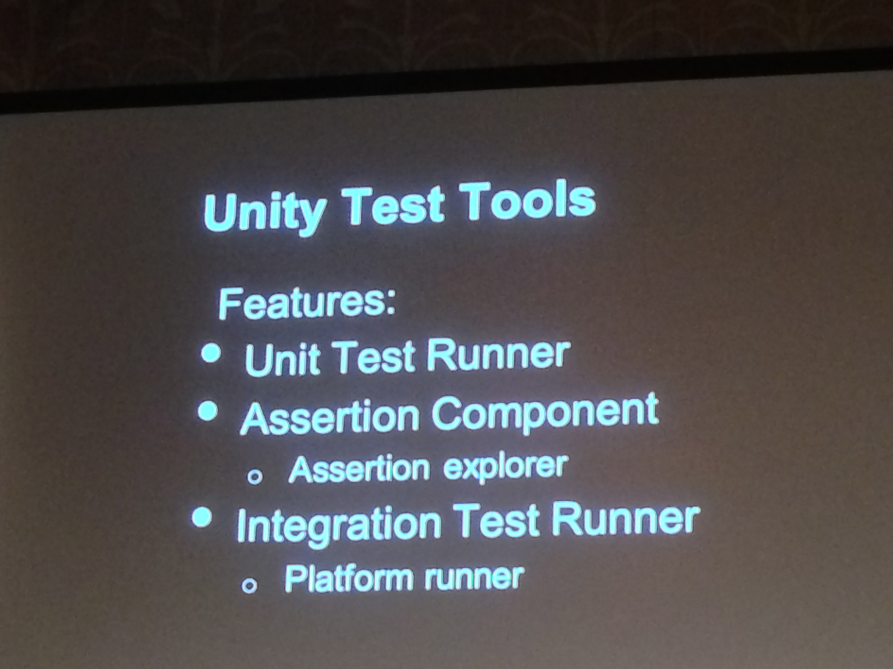
* 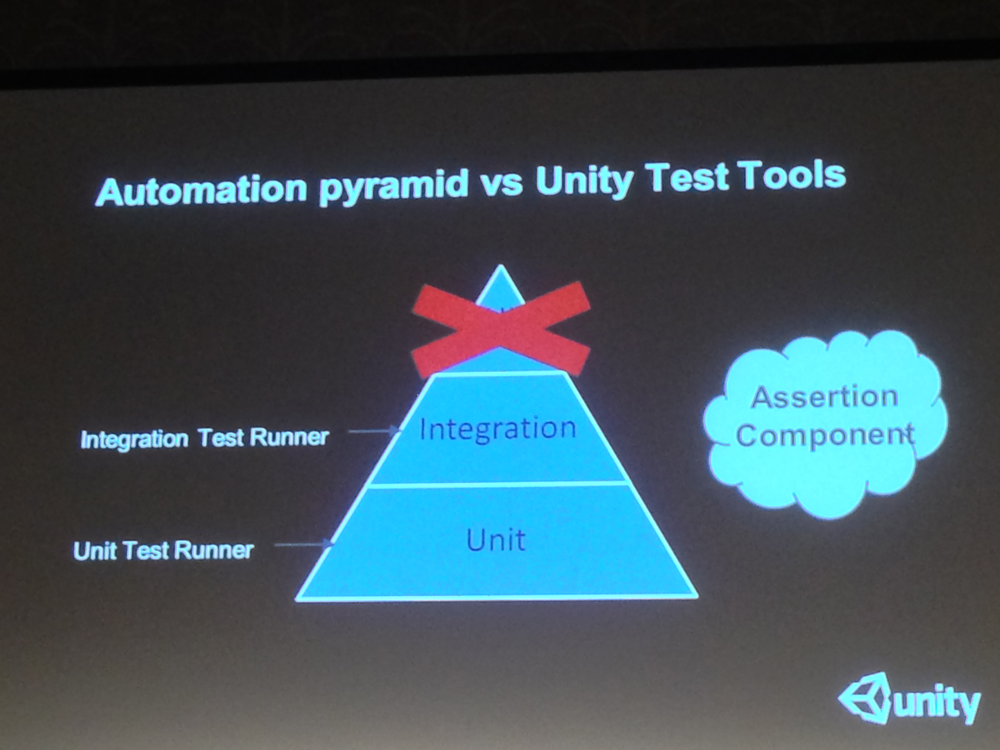

* monoBahabireでテストを書くには -> 継承するのが難し
	* Unit Test Runner
	* Hanble onject pattern

* モックしてるなあ
* Monobehavireを継承していない
* unit tesは早く 柔軟性に飛んでいるべき メモリ上で行うべき
* gameObjectをinstantiateをする可能性があるが、なるべくするなとのこと
* undo test runnner -> testrunnerできたobjectを削除する
* テストコードでシーンを汚くするのは避けたい
* runner Run on recompile -> 毎回実行
* Run tests on a new scene -> runnerに新しいイーンで実行 シーンを開け直す
* AutoSave もできる
* Detail Box -> どうして失敗したかが表示される
* うまく行ったテストを隠すとかのフィルターも用意されている
* 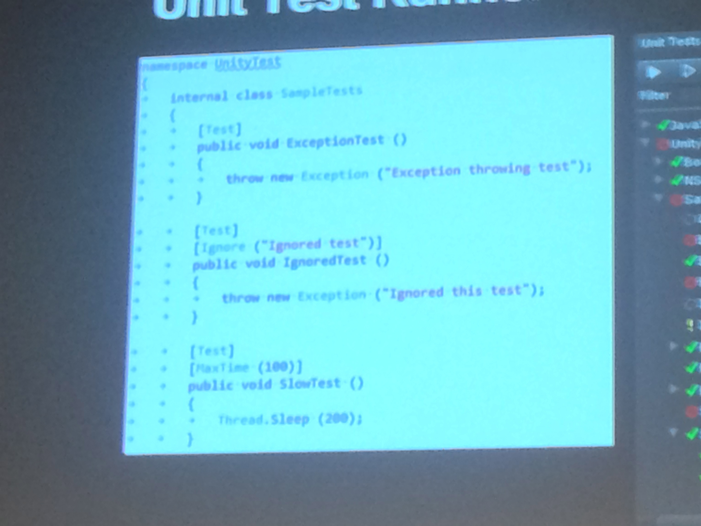
* 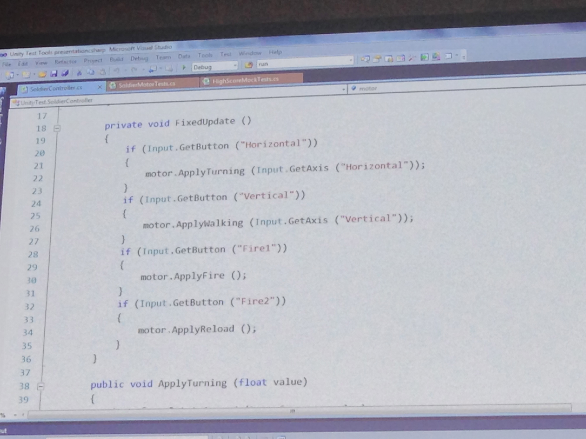
* 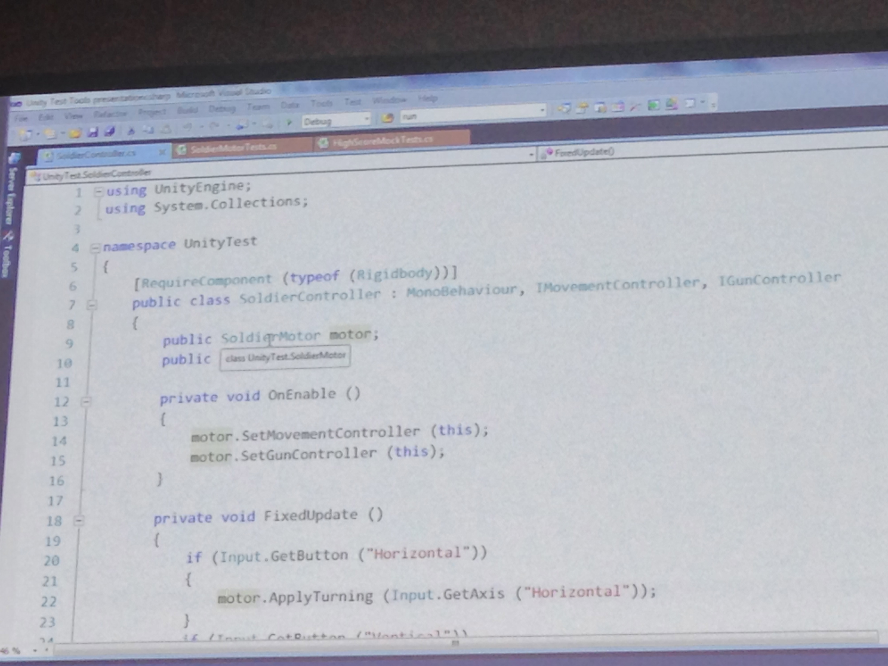
* 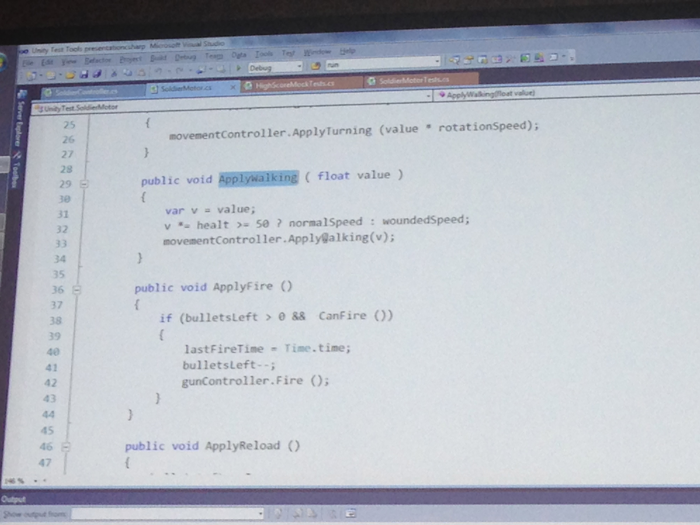
* 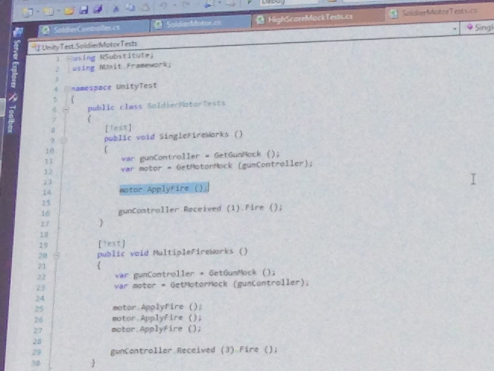
* c# booでテスト可能 JSはどうもないぽい

### Assertion Compnent
* 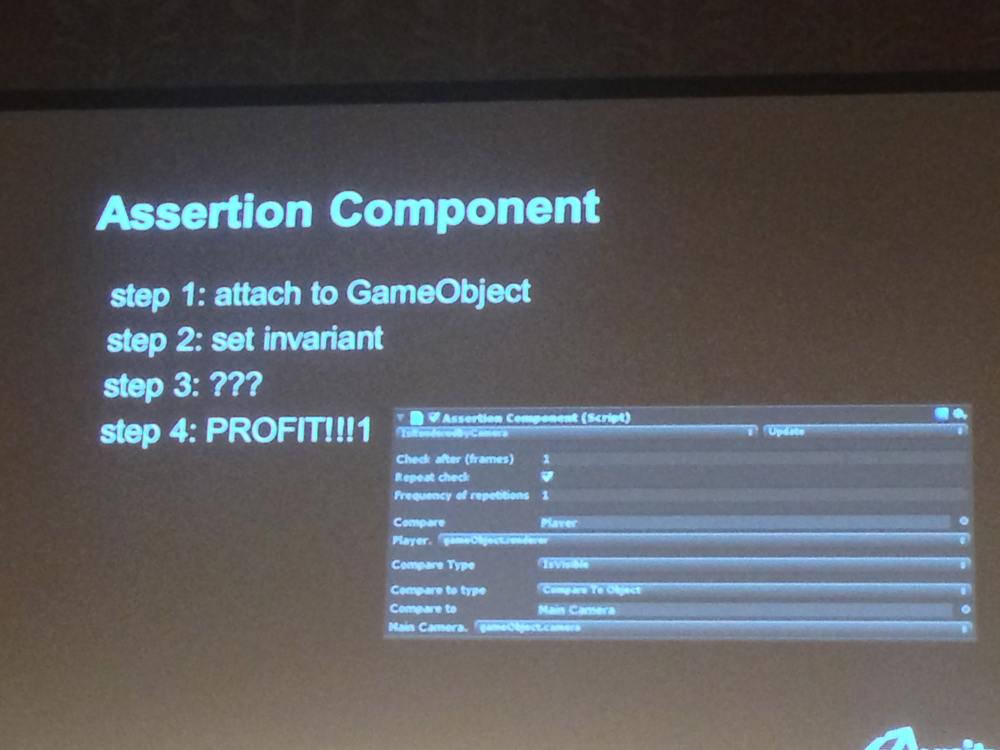
* stateがある期間保持されているかとかのcheckをできる
* Assertion -> speedのcheck
* 例外が発生するようになる

* compareｒの設定
* ２つのオブジェクトを設定
* 自分で拡張してcompareを作れる floatのcheckとか
* 比較したいオブジェクトはダイナミックリフレクションで指定

* ダウンロードしてみた: Asset Store - Unity Test Tools assetstore.unity3d.com/#/content/13802
* assertionが失敗すると例外
* コードのリリースビルド -> assetion削除したい
* Assertion Exploerがある -> disableできる

### Integration Test Runnner
* 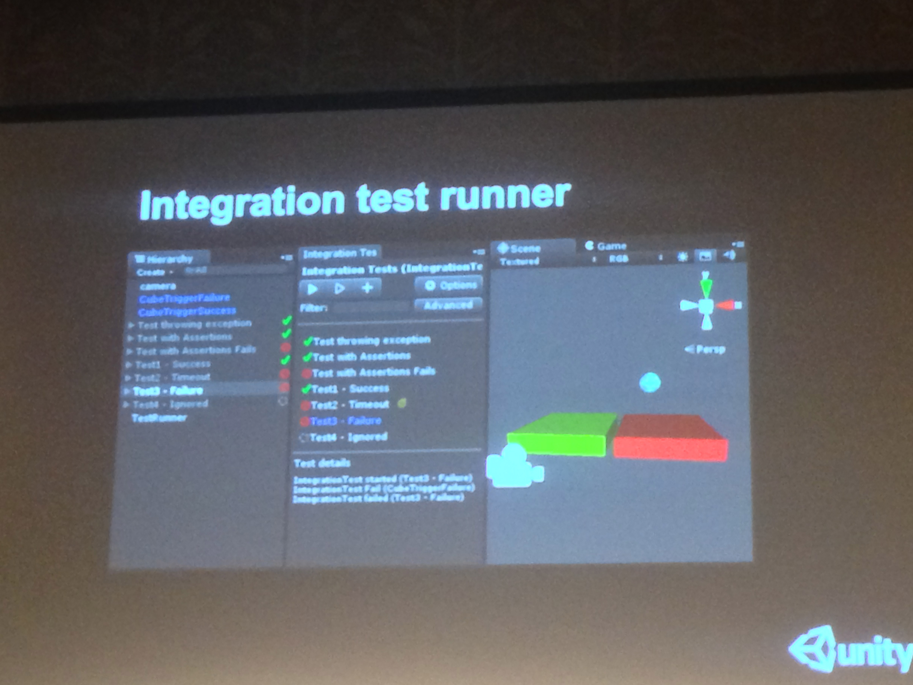
* シーンベースのテスト
* テストのはいったオブジェクトを追加
* timeoutのローディング
* unit -> start exitのがわかりやすい
* integration -> exitがわかりない -> exitの定義はしなければならない
* IntegrationTestを呼ぶ
* Pass と Failが入っている
* CallTestingというのが用意されている
* suceed on assertion -> asertion　テストのassertionが１回でも呼ばれて成功すればOK
* Expect excpetion ->  例外を無視する ただ結果をみることもできる

* 特定のUnity Monobehaviourが呼び出すメソッドをフックして、テストを走らせる事が出来る。  たとえばUpdateが呼ばれたのをフックして、テストを走らせる。 通過したらPassを呼ぶ。など

* platform runner
* 使っているplatformでのテストをしやすくする
* どこにエラーがあるのか分かる
* 複数にシーンを選んで実行も可能 あわさった結果がでる

### Batch runもある
* テスト自動化 batch run
* integration testは screenに表示したくない xmlで結果を確認できる

* assete storeで配布済み

* iOSにおけるビルド
* android web playerではfailしない しかいiOSでfail NUnitの実行ができない
	* iOSはテストしていないだとおおおお

* UIテストはしない -> これはいいと思う
* inputをテストしないほうがいいと思う -> 同意

* UnityTestTool、AssetStoreで無料公開中。ドキュメントは英語だけど、UnityJapanの方が日本語に翻訳してくれたらしい。

* UnityTestToolはUIレベルのテスト自動化は対応外かー。できれば一連のゲームループを十数時間自動で走らせたいんだけど、やっぱり自動実行コードを自前で書いて埋め込まないといけないかー。
